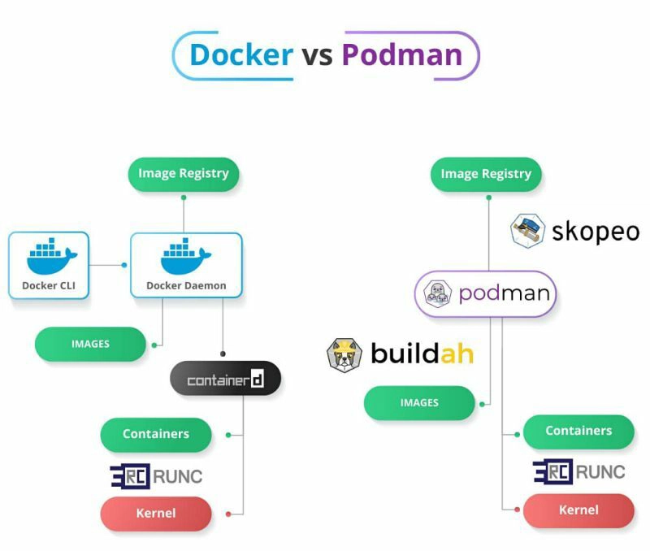

The biggest difference of [podman](https://podman.io/) and [docker](https://www.docker.com/) is
that `podman` do not have any daemon, so collecting metrics could be a little bit difficult.

## Find all containers

```shell
# podman info
store:
  configFile: /home/xxxxxxxx/.config/containers/storage.conf
  graphRoot: /home/xxxxxxxx/.local/share/containers/storage
  runRoot: /run/user/1000/containers
  volumePath: /home/xxxxxxxx/.local/share/containers/storage/volumes
```

Like docker, podman stores its state on host 

`$graphRoot/overlay-containers/containers.json`
```json
[
  {
    "id": "57656b20fb883085861e0047f87e29302bfb811ca3e13ab9308650b7070f2fd5",
    "names": [
      "sleepy_ramanujan"
    ],
    "image": "97662d24417b316f60607afbca9f226a2ba58f09d642f27b8e197a89859ddc8e",
    "layer": "2115060fb7fe51dd2068d56ab4976450dd70f010051df5c5be7fd39fa98138a0",
    "metadata": "{\"image-name\":\"docker.io/library/nginx:1.27.4\",\"image-id\":\"97662d24417b316f60607afbca9f226a2ba58f09d642f27b8e197a89859ddc8e\",\"name\":\"sleepy_ramanujan\",\"created-at\":1760200649}",                                                                                        
    "created": "2025-10-11T16:37:29.214855063Z",
    "flags": {
      "MountLabel": "system_u:object_r:container_file_t:s0:c672,c910",
      "ProcessLabel": "system_u:system_r:container_t:s0:c672,c910"
    }
  }
]
```

`$graphRoot/overlay-images/images.json`
```json
[
  {
    "id": "97662d24417b316f60607afbca9f226a2ba58f09d642f27b8e197a89859ddc8e",
    "digest": "sha256:9e99f6cd0918df7f2798ae61eecaeadb0e946101035ae801d4070fc23edff6fa",
    "names": [
      "docker.io/library/nginx:1.27.4"
    ],
    "names-history": [
      "docker.io/library/nginx:1.27.4"
    ],
    "layer": "d6013af268eea2ba682c4fa922187978220a59478aadc7e9a510b9e93f232470",
    "metadata": "{}",
    "big-data-names": [
      "sha256:97662d24417b316f60607afbca9f226a2ba58f09d642f27b8e197a89859ddc8e",
      "manifest-sha256:9e99f6cd0918df7f2798ae61eecaeadb0e946101035ae801d4070fc23edff6fa",
      "manifest"
    ],
    "big-data-sizes": {
      "manifest": 1307,
      "manifest-sha256:9e99f6cd0918df7f2798ae61eecaeadb0e946101035ae801d4070fc23edff6fa": 1307,
      "sha256:97662d24417b316f60607afbca9f226a2ba58f09d642f27b8e197a89859ddc8e": 8582
    },
    "big-data-digests": {
      "manifest": "sha256:9e99f6cd0918df7f2798ae61eecaeadb0e946101035ae801d4070fc23edff6fa",
      "manifest-sha256:9e99f6cd0918df7f2798ae61eecaeadb0e946101035ae801d4070fc23edff6fa": "sha256:9e99f6cd0918df7f2798ae61eecaeadb0e946101035ae801d4070fc23edff6fa",                                                                                                                                    
      "sha256:97662d24417b316f60607afbca9f226a2ba58f09d642f27b8e197a89859ddc8e": "sha256:97662d24417b316f60607afbca9f226a2ba58f09d642f27b8e197a89859ddc8e"                                                                                                                                              
    },
    "created": "2025-02-05T21:27:16Z"
  }
]
```

Now, we have got all information about images and containers

### Finding out all `running` containers

All running containers must have a `pidfile`, for example

```shell
cat $runRoot/overlay-containers/6af17555490a1e9a2505b3128e5f1b2bc1243bf8b36e808b571b9686ca2cf7d0/userdata/pidfile
12345
```

Then, get cgroup info
```shell
cat /proc/12345/cgroup
0::/user.slice/user-1000.slice/user@1000.service/user.slice/libpod-6af17555490a1e9a2505b3128e5f1b2bc1243bf8b36e808b571b9686ca2cf7d0.scope/container
```

Now, we got everything we need, but network stats
```shell
ls /sys/fs/cgroup/user.slice/user-1000.slice/user@1000.service/user.slice/libpod-6af17555490a1e9a2505b3128e5f1b2bc1243bf8b36e808b571b9686ca2cf7d0.scope/container/
cgroup.controllers      cgroup.procs            cpu.max.burst   cpu.weight.nice  io.weight            memory.max        memory.stat           memory.zswap.max
cgroup.events           cgroup.stat             cpu.pressure    io.bfq.weight    irq.pressure         memory.min        memory.swap.current   memory.zswap.writeback
cgroup.freeze           cgroup.subtree_control  cpu.stat        io.latency       memory.current       memory.numa_stat  memory.swap.events    pids.current
cgroup.kill             cgroup.threads          cpu.stat.local  io.max           memory.events        memory.oom.group  memory.swap.high      pids.events
cgroup.max.depth        cgroup.type             cpu.uclamp.max  io.pressure      memory.events.local  memory.peak       memory.swap.max       pids.events.local
cgroup.max.descendants  cpu.idle                cpu.uclamp.min  io.prio.class    memory.high          memory.pressure   memory.swap.peak      pids.max
cgroup.pressure         cpu.max                 cpu.weight      io.stat          memory.low           memory.reclaim    memory.zswap.current  pids.peak
```

